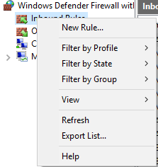
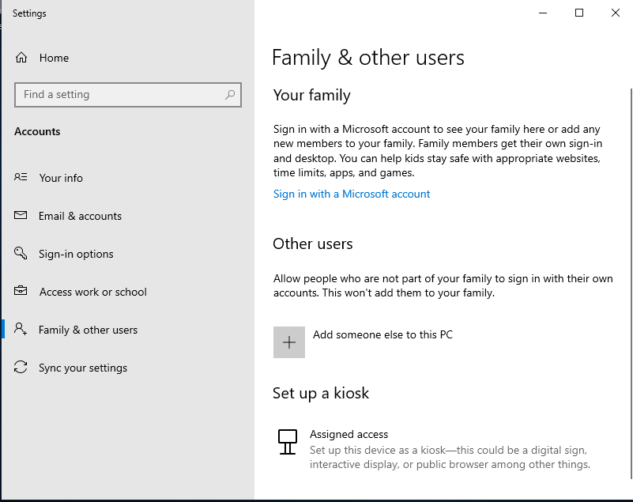
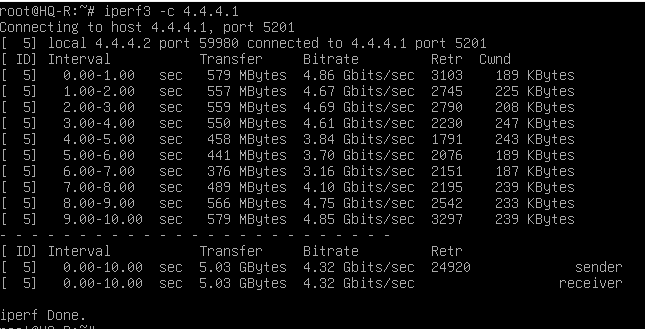
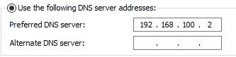
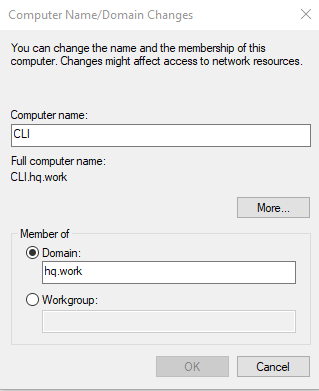

___

<h1>Модуль 1: Выполнение работ по проектированию сетевой инфраструктуры</h1>

___

<h2>1. Выполнить базовую настройку всех устройств:</h2>
*Текст задание*

    Выполните базовую настройку всех устройств:
        a. Присвоить имена в соответствии с топологией
        b. Рассчитайте IP-адресацию IPv4 и IPv6. Необходимо заполнить таблицу №1, чтобы эксперты могли проверить ваше рабочее место.
        c. Пул адресов для сети офиса BRANCH - не более 16
        d. Пул адресов для сети офиса HQ - не более 64

<h3><u>Настроить на всех устройствах Linux</u></h3>
* Использовать команду на ISP

    hostnamectl hostname ISP
    reboot
* Использовать команды на HQ-R

    hostnamectl hostname HQ-R
    reboot
* Использовать команды на HQ-SRV

    hostnamectl hostname HQ-SRV
    reboot
* Использовать команды на BR-R
 
>reboot
>hostnamectl hostname BR-R
 
>reboot
* Использовать команды на BR-SRV

    hostnamectl hostname BR-SRV
    reboot

<h3><u>Настроить на устройстве Windows</u></h3>

**Выполнен пункт задания: А**

<h2>Рассчитать IPV4 и IPV6 адреса</h2>

| Устройство | IPV4                             | IPV6                                    |
|------------|----------------------------------|-----------------------------------------|
| CLI        | 5.5.5.2/24                       | cafe::2/64                              | 
| ISP        | 3.3.3.1/26 4.4.4.1/28 5.5.5.1/24 | cafe::/64 dead::de01/122 face::fac1/124 |
| HQ-R       | 3.3.3.2/26 192.168.100.1/26      | dead::de02/122 deda::de01/122           |
| HQ-SRV     | 192.168.100.2/26                 | deda::de02/122                          |
| BR-R       | 4.4.4.2/28 172.16.100.1/28       | face::fac2/124 fefe::fef1/124           |
| BR-SRV     | 172.16.100.2/28                  | fefe::fef2/124                          |

**Выполнен пункты заданий: Б, С, Д**
___

<h2>2. Настроить маршрутизацию</h2>
*Текст задание*

    Настройте внутреннюю динамическую маршрутизацию по средствам FRR. Выберите и обоснуйте выбор протокола
    динамической маршрутизации из расчёта, что в дальнейшем сеть будет масштабироваться.
        a. Составьте топологию сети L3.

<h3><u>Настроить сетевые интерфейсы на ISP</u></h3>
* Вывести список сетевых интерфейсов 

    ip a

* Открыть конфигурационный файл сетевых интерфейсов

    /etc/network/interfaces

* Добавить виртуальные сетевых интерфейсы и IPV4, IPV6 адреса

      auto enp0s8
      iface enp0s8 inet static
          address 3.3.3.1
          netmask 255.255.255.0
      
      iface enp0s8 inet6 static
          address cafe::1
          netmask 64

      auto enp0s9
      iface enp0s9 inet static
          address 4.4.4.1
          netmask 255.255.255.192
      
      iface enp0s9 inet6 static
          address dead::de01
          netmask 122

      auto enp0s10
      iface enp0s10 inet static
          address 5.5.5.1
          netmask 255.255.255.240
      
      iface enp0s10 inet6 static
          address face::fac1
          netmask 124

* Перезапустить демон networking

    systemctl restart networking

<h3><u>Настроить сетевые интерфейсы на HQ-R</u></h3>
* Вывести список сетевых интерфейсов

    ip a

* Открыть конфигурационный файл сетевых интерфейсов

    /etc/network/interfaces

* Добавить виртуальные сетевых интерфейсы и IPV4, IPV6 адреса

      auto enp0s8
      iface enp0s8 inet static
          address 4.4.4.2
          netmask 255.255.255.192
      
      iface enp0s8 inet6 static
          address dead::de02
          netmask 122

      auto enp0s9
      iface enp0s9 inet static
          address 192.168.100.1
          netmask 255.255.255.192
      
      iface enp0s9 inet6 static
          address deda::de01
          netmask 122

* **Перезапустить демон networking**
>systemctl restart networking

<h3><u>Настроить сетевые интерфейсы на HQ-SRV</u></h3>
* **Вывести список сетевых интерфейсов** 
>ip a

* **Открыть конфигурационный файл сетевых интерфейсов**
>/etc/network/interfaces

* **Добавить виртуальные сетевых интерфейсы и IPV4, IPV6 адреса** 

      auto enp0s8
      iface enp0s8 inet static
          address 192.168.100.2
          netmask 255.255.255.192
      
      iface enp0s8 inet6 static
          address deda::de02
          netmask 122

* **Перезапустить демон networking**
>systemctl restart networking

<h3><u>Настроить сетевые интерфейсы на BR-R</u></h3>
* **Вывести список сетевых интерфейсов** 
>ip a

* **Открыть конфигурационный файл сетевых интерфейсов**
>/etc/network/interfaces

* **Добавить виртуальные сетевых интерфейсы и IPV4, IPV6 адреса** 

      auto enp0s8
      iface enp0s8 inet static
          address 5.5.5.2
          netmask 255.255.255.240
      
      iface enp0s8 inet6 static
          address face::fac2
          netmask 124

      auto enp0s9
      iface enp0s9 inet static
          address 172.16.100.1
          netmask 255.255.255.240
      
      iface enp0s9 inet6 static
          address fefa::fef1
          netmask 124

* **Перезапустить демон networking**
>systemctl restart networking

<h3><u>Настроить сетевые интерфейсы на BR-SRV</u></h3>
* **Вывести список сетевых интерфейсов** 
>ip a

* **Открыть конфигурационный файл сетевых интерфейсов**
>/etc/network/interfaces

* **Добавить виртуальные сетевых интерфейсы и IPV4, IPV6 адреса** 

      auto enp0s8
      iface enp0s8 inet static
          address 172.16.100.2
          netmask 255.255.255.240
      
      iface enp0s8 inet6 static
          address fefa::fef2
          netmask 124

* **Перезапустить демон networking**
>systemctl restart networking

<h3><u>Установить FRR на всех устройствах Linux</u></h3>
>apt-get install frr -y

<h3><u>Настроить forwarding IPV4 и IPV6 на всех устройствах Linux</u></h3>
``Открыть /etc/sysctl.conf и раскомментировать следующие строки:``

>net.ipv4.ip_forward=1

>net.ipv6.conf_all_forwarding=1

<h3><u>Настроить брандмауэр на Windows Cli</u></h3>

* **Открываем firewall**

* **Открываем все порты**

<h3><u>Включить маршрутизацию BGP и OSPF на HQ-R, ISP, BR-R</u></h3>
* **Открыть /etc/frr/daemons и включить демоны маршрутизации BGPD и OSPFD**
>bgpd=yes

>ospfd=yes

>ospf6d=yes 

* **Перезапустить службу FRR**
>systemctl restart frr 

<h3><u>Включить маршрутизацию OSPF на HQ-SRV, BR-SRV</u></h3>

* **Открыть /etc/frr/daemons и включить демон маршрутизации OSPFD**
>ospfd=yes

* **Перезапустить службу frr**
>systemctl restart frr

<h3><u>Настроить BGP-маршрутизацию на ISP</u></h3>
* **Открыть оболочку для FRR**
>vtysh
* **Открыть режим конфигурирование**
>configure terminal
* **Выбрать машрутизатор BGP**
>router bgp 1

* **Выключить автоматическую синхронизацию**
>no synchronization

* **Указать router-id**

    bgp-router-id 3.3.3.3

* **Указать соседние маршрутизаторы**

    neighbor 4.4.4.2 remote-as 1
    neighbor 5.5.5.2 remote-as 1
    neighbor dead::de02 remote-as 1
    neighbor face:fac2 remote-as 1

* **Добавить маршруты и включить перераспределение маршрутов IPV4**
>address-family ipv4 unicast

    network 3.3.3.0/24
    network 4.4.4.0/26
    network 5.5.5.0/28
    redistribute connected

* **Добавить маршруты и включить перераспределение маршрутов IPV6**
>address-family ipv6 unicast

    network cafe::/64
    network dead::de00/122
    network face::fac0/124
    redistribute connected
    neighbor dead::de02 actviete
    neighbor face::fac2 activate

* **Сохранить конфигурацию**
>do wr mem

<h3><u>Настроить BGP и OSPF маршрутизацию на HQ-R</u></h3>
* **Настроить машрутизатор BGP, указать соседние маршрутизаторы и включить перераспределение маршрутов**
>router bgp 1

    neighbor 4.4.4.1 remote-as 1
    neighbor 5.5.5.2 remote-as 1
    neighbor dead::de01 remote-as 1
    neighbor face::fac2 remote-as 1

* **Добавить маршруты и включить перераспределение маршрутов IPV6**

    address-family ipv4 unicast
    redistribute connected

    address-family ipv6 unicast
    redistribute connected
    redistribute ospf6
    neighbor dead::de01 activate
    neighbor face::fac2 activate

* **Настроить машрутизатор ospf, указать соседние маршрутизаторы, настроить маршруты и включить перераспределение маршрутов**
>router ospf
    
    ospf router-id 192.168.100.1
    redistribute connected
    redistribute bgp
    neighbor 192.168.100.2
    network 3.3.3.0/24 area 0
    network 4.4.4.0/26 area 0
    network 5.5.5.0/28 area 0
    network 192.168.100.0/26 area 0
    network 172.16.100.0/28 area 0

* **Настроить маршрутизатор ospf6, настроить интерфейсы и включить перераспределение маршрутов**

    interface enp0s8
    ipv6 ospf6 area 0

    interface enp0s9
    ipv6 ospf6 area 0

>router ospf6
    ospf6 router-id 1.0.0.0    
    redistribute connected
    redistribute bgp

<h3><u>Настроить OSPF маршрутизацию на HQ-SRV</u></h3>

* **Настроить маршруты и включить перераспределение маршрутов**

    
>router ospf
    ospf router-id 192.168.100.2
    network 192.168.100.0/26 area 0
    neighbor 192.168.100.1

* **Настроить маршрутизатор ospf6, настроить интерфейсы и включить перераспределение маршрутов**

    interface enp0s8
    ipv6 ospf6 area 0

>router ospf6
    
    ospf6 router-id 1.0.0.1

<h3><u>Настроить BGP и OSPF маршрутизацию на BR-R</u></h3>
* **Настроить машрутизатор BGP, указать соседние маршрутизаторы и включить перераспределение маршрутов**
>router bgp 1

    bgp router-id 5.5.5.5
    neighbor 4.4.4.2 remote-as 1
    neighbor 5.5.5.1 remote-as 1
    neighbor dead::de02 remote-as 1
    neighbor face::fac1 remote-as 1

#

    address-family ipv4 unicast
    redistribute connected

    address-family ipv6 unicast
    redistribute connected
    redistribute ospf6
    neighbor dead::de02 activate
    neighbor face::fac1 activate

* **Настроить машрутизатор ospf, указать соседние маршрутизаторы, настроить маршруты и включить перераспределение маршрутов**
>router ospf

    ospf router-id 172.16.100.1
    redistribute connected
    redistribute bgp
    neighbor 172.16.100.2
    network 3.3.3.0/24 area 0
    network 4.4.4.0/26 area 0
    network 5.5.5.0/28 area 0
    network 192.168.100.0/26 area 0
    network 172.16.100.0/28 area 0

* **Настроить маршрутизатор ospf6, настроить интерфейсы и включить перераспределение маршрутов**

    interface enp0s8
    ipv6 ospf6 area 0

    interface enp0s9
    ipv6 ospf6 area 0

>router ospf6
    ospf6 router-id 1.0.0.2 
    redistribute connected
    redistribute bgp

<h3><u>Настроить OSPF маршрутизацию на BR-SRV</u></h3>

* **Настроить маршруты и включить перераспределение маршрутов**

    
>router ospf
    ospf router-id 172.16.100.2
    network 172.16.100.0/28 area 0
    neighbor 172.16.100.1

* **Настроить маршрутизатор ospf6, настроить интерфейсы и включить перераспределение маршрутов**

    interface enp0s8
    ipv6 ospf6 area 0

>router ospf6
    
    ospf6 router-id 1.0.0.3

* **Проверить соседние маршрутизаторы**

>sh bgp summart

>sh ip ospf neighbor

>sh ipv6 ospf6 neighbor

* **Проверить автоматические маршруты**

>sh ip route

>sh ipv6 route

-[x] Выполнен пункт задания: А

log file /var/log/quagga/quagga.log - собирать логи с vtysh

#

<h2>3. Настроить сервер и клиент DHCP</h2>

* **Установить DHCP сервер на HQ-R**
>apt-get install isc-dhcp-server 

* **Редактировать конфигурационный файл /etc/dhcp/dhcpd.conf на HQ-R**

* **Объявить подсеть в которой будет раздача DHCP адресов, остальным подсетям объявить пустые range, убрать комментарий из authoritative**

    
    authoritative;
    
    subnet 4.4.4.0 netmask 255.255.255.192 {
    }
    
    subnet 10.0.2.0 netmask 255.255.255.0 {
    }

    subnet 192.168.100.0 netmask 255.255.255.192 {
      range 192.168.100.2 192.168.100.63;
    }
    
    host HQ-SRV {
      hardware ethernet (надо узнать из команды ip на HQ-SRV)
      fixed-address 192.168.100.2;
    }

* **Редактировать конфигурационный файл /etc/network/interfaces на HQ-SRV**

* **Включить DHCP на интерфейсе**
    
  
    auto enp0s8
    iface enp0s8 inet dhcp

* **Добавить в конфиг /etc/default/isc-dhcp-server, интерфейс для ipv4**

    INTERFACESv4="enp0s9"

* **Перезапустить isc-dhcp-server**

>systemctl restart isc-dhcp-server.service
    
<h2>4. Настройте локальные учётные записи на всех устройствах в соответствии с таблицей</h2>

| Учётная запись | Пароль   | Устройства       |
|----------------|----------|------------------|
| Admin          | P@ssw0rd | CLI HQ-SRV HQ-R  | 
| Branch admin   | P@ssw0rd | BR-SRV BR-R      |
| Network admin  | P@ssw0rd | HQ-R BR-R BR-SRV |

* **Создать пользователя Admin на CLI**

* **Нажать на кнопку "Add someone else to this PC**

* **Создать пользователя Admin на HQ-SRV, HQ-R**

>useradd Admin -p P@ssw0rd

* **Создать пользователя Branch_Admin на BR-SRV, BR-R**

>useradd Branch_Admin -p P@ssw0rd

* **Создать пользователя Network_Admin на HQ-R, BR-R, BR-SRV**

>useradd Network_Admin -p P@ssw0rd

<h2>5. Измерьте пропускную способность сети между двумя узлами HQ-R-ISP по средствам утилиты iperf 3. Предоставьте описание пропускной способности канала со скриншотами.</h2>

* **Установить IPERF3 на HQ-R и ISP**

>apt-get install iperf3 -y

* **Измерить пропускную способность**

>iperf3 -c 4.4.4.1

<h2>6. Составьте backup скрипты для сохранения конфигурации сетевых устройств, а именно HQ-R BR-R. Продемонстрируйте их работу.</h2>

* **Создадим нужные папки Backups**

>mkdir Backups
>mkdir Backups/interfaces
>mkdir Backups/frr
>mkdir Backups/dhcpd

* **Создадим скрипт с таким содержимым:**

    cp /etc/network/interfaces interfaces/interfaces_$(date + "%F")
    cp /etc/frr/frr.conf frr/frr_$(date + "%F")
    cp /etc/dhcp/dhcpd.conf dhcpd/dhcpd_$(date + "%F")    

* **Запустить бэкап скрипт**

> .(название_скрипта)

<h2>7. Настроить SSH</h2>

Текст задание 1.

    Настройте подключение по SSH для удалённого конфигурирования 
    устройства HQ-SRV по порту 2222.
    Учтите, что вам необходимо перенаправить трафик на этот порт
    по средствам контролирования трафика.

* **Установить openssh-server на всех устройствах Linux**
>apt-get install openssh-server -y

* **Создать файл баннер на всех устройствах Linux**

* **Настроить конфигурацию /etc/ssh/sshd_config на всех устройствах Linux**

    Port 22
    PermitRootLogin Yes
    PasswordAuthentication Yes

* **Перезапустить демон SSHD на всех устройствах Linux**

>systemctl restart sshd.service

* **Подключится по SSH с перенаправлением траффика через маршрутизатор**

>ssh -R 2222:192.168.100.1:22 root@192.168.100.2

* **Проверить используемый порты**

>ss -tl

<h2>8. Настроить межсетевой экран на HQ-SRV</h2>

* **Установить межсетевой экран**

>apt-get install ufw -y

* **Включить межсетевой экран**

>ufw enable

* **Добавить правила**

    
    ufw default allow incoming
    ufw default allow outgoing
        
    ufw deny from 3.3.3.0/24 to 192.168.100.2 app OpenSSH
    ufw deny from cafe::/64 to deda::de02 app OpenSSH
    
___
<h1>Модуль 2: Организация сетевого администрирования</h1>

<h2>1. Настройка Chrony сервера и клиента</h2>

*Текст задание* 

      Настройте синхронизацию времени между сетевыми устройствами по протоколу NTP.
         a. В качестве сервера должен выступать роутер HQ-R со стратумом 5
         b. Используйте Loopback интерфейс на HQ-R, как источник сервера времени
         c. Все остальные устройства и сервера должны синхронизировать свое время с роутером HQ-R
         d. Все устройства и сервера настроены на московский часовой пояс (UTC +3)

* **Установить Chrony на всех устройствах Linux**

>apt-get install chrony -y

* **Включить автозапуск службы**

>systemctl enable chrony

* **Установить часовой пояс по МСК (UTC +3) на Chrony сервере - HQ-R**

>timedatectl set-timezone Europe/Moscow

* **Настроить на Chrony сервере - HQ-R конфигурацию /etc/chrony/chrony.conf**

    #pool.2.debian.pool.ntp.org iburst

    server localhost
    allow 3.3.3.0/24
    allow 4.4.4.0/26
    allow 192.168.100.0/26
    allow 5.5.5.0/28
    allow 172.16.100.0/28

    allow cafe::/64
    allow dead::de00/122
    allow deda::de00/122
    allow face::fac0/124
    allow fefe::fef0/124

    local stratum 5

* **Перезапускаем службу или полностью устройство**

>systemctl restart chrony

* **Настроить конфигурацию Chrony /etc/chrony/chrony.conf на клиентских устройствах** 

    #pool.2.debian.pool.ntp.org iburst

    server 4.4.4.2 iburst
    server deda::de02 iburst

* **Перезапускаем службу или полностью устройство**

>systemctl restart chrony

``Примечание: Сhrony будет искать сервер для подключение по-очереди из списка сетевых интерфейсов``

* **Выполнить команду, для проверки серверов источников** 
>chronyc sources -v

* **Выполнить команду, для проверки синхронизации с сервером**
>timedatectl

* **Выполнить команду, для детальной проверки синхронизации с chrony сервером** 
>chronyc tracking

* **Настроить NTP-клиент на Windows 10**

___

<h2>2. Настройка сервер и клиент Samba + Kerberos + DNS</h2>

* **Редактировать конфигурациюю /etc/hosts**

    192.168.100.2   HQ-SRV.HQ.WORK  HQ-SRV

* **Изменить hostname**

>hostnamectl hostname HQ-SRV.HQ.WORK

* **Редактировать конфигурацию /etc/dhcp/dhclient.conf**

  
    prepend domain-name-servers 192.168.100.2;

* **Установить пакеты**

>apt-get install samba smbclient winbind krb5-user krb5-config -y

    
    Область по умолчанию для Kerberos:
      HQ.WORK
    Сервер Kerberos для вашей области:
      HQ-SRV.HQ.WORK
    Управляющий сервер Kerberos:
      HQ-SRV.HQ.WORK

* **Выключить службы**

>systemctl disable --now samba-ad-dc smbd nmbd winbind

* **Удалить стандартную кофигурацию**

    unlink /etc/samba/smb.conf
    unlink /etc/krb5.conf

* **Настроить Samba AD DC**

>samba-tool domain provision --use-rfc2307 --interactive

    Realm: HQ.WORK
    Domain: HQ
    Domain: dc
    DNS Backend: Samba_Internal
    DNS forwarder IP address: 192.168.100.2
    Administrator password: P@ssw0rd

* **Копируем конфигурацию Kerberos**

>cp /var/lib/samba/private/krb5.conf /etc/krb5.conf

* **Создать символическую ссылку на keytab**

ln -s /var/lib/samba/private/secrets.keytab /etc/krb5.keytab

* **Запустить Samba AD**

    systemctl unmask samba-ad-dc.service
    systemctl enable --now samba-ad-dc.service

* **Получить тикет от Kerberos**

>kinit Administrator

* **Создадим пользователя samba**

>samba-tool user add Admin

* **Добавить DNS-сервер IPV4 IPV6 на CLI**

* **Войти в домен HQ.WORK на CLI**

* **Войти под пользователем Samba**

* **Установить Samba+Kerberos на клиенете BR-SRV**

>apt-get install install krb5-user samba winbind -y

    Область по умолчанию для Kerberos:
      HQ.WORK
    Сервер Kerberos для вашей области:
      HQ-SRV.HQ.WORK
    Управляющий сервер Kerberos:
      HQ-SRV.HQ.WORK

* **Редактировать конфигурацию /etc/dhcp/dhclient.conf**

    prepend domain-name "HQ.WORK";
    prepend domain-name-servers 192.168.100.2;

* **Изменить hostname**

>hostnamectl hostname BR-SRV.HQ.WORK

* **Редактировать /etc/samba/smb.conf**

    dns forwarder = 192.168.100.2
    realm = HQ.WORK
    workgroup = HQ
    security = ADS

* **Перезапустить BR-SRV**

>reboot

* **Получить тикет от Kerberos**

>kinit Administrator

* **Войти в домен HQ.WORK на BR-SRV**

>net ads join -U Administrator

* **Добавить записи и зону для DNS сервера**

    samba-tool dns add hq-srv hq.work hq-r A 192.168.100.1
    samba-tool dns add hq-srv hq.work hq-r PTR 192.168.100.1
    samba-tool dns add hq-srv hq.work isp A 4.4.4.1
    samba-tool dns add hq-srv hq.work isp PTR 4.4.4.1

    samba-tool dns zonecreate hq-srv branch.work

    samba-tool dns add hq-srv branch.work br-r A 5.5.5.2
    samba-tool dns add hq-srv branch.work br-r PTR 5.5.5.2
    samba-tool dns add hq-srv branch.work br-srv A 172.16.100.2

___

<h1>Модуль 3: Эксплуатация объектов сетевой инфраструктуры</h1>
  
___

    PermitEmptyPasswords no
    PasswordAuthentication Yes
    MaxAuthTries 4
    ClientAliveInterval 5

#########################################################
 <h3><u>Настроить на всех устройствах Linux</u></h3>

<h2>1. Настройка сервера и клиента Rsyslog</h2>

*Текст задание*

      Реализуйте мониторинг по средствам rsyslog на всех Linux хостах.
         a. Составьте отчёт о том, как работает мониторинг

 <h3><u>Настроить на всех устройствах Rsyslog</u></h3>

**Установить Rsyslog** 
``apt-get install rsyslog -y``

**Включить автозапуск Rsyslog** 
``systemctl enable rsyslog``

<h3><u>Настроить на сервере</u></h3>

<h3><u>Настроить на клиенте</u></h3>

apt-get install sysstat
